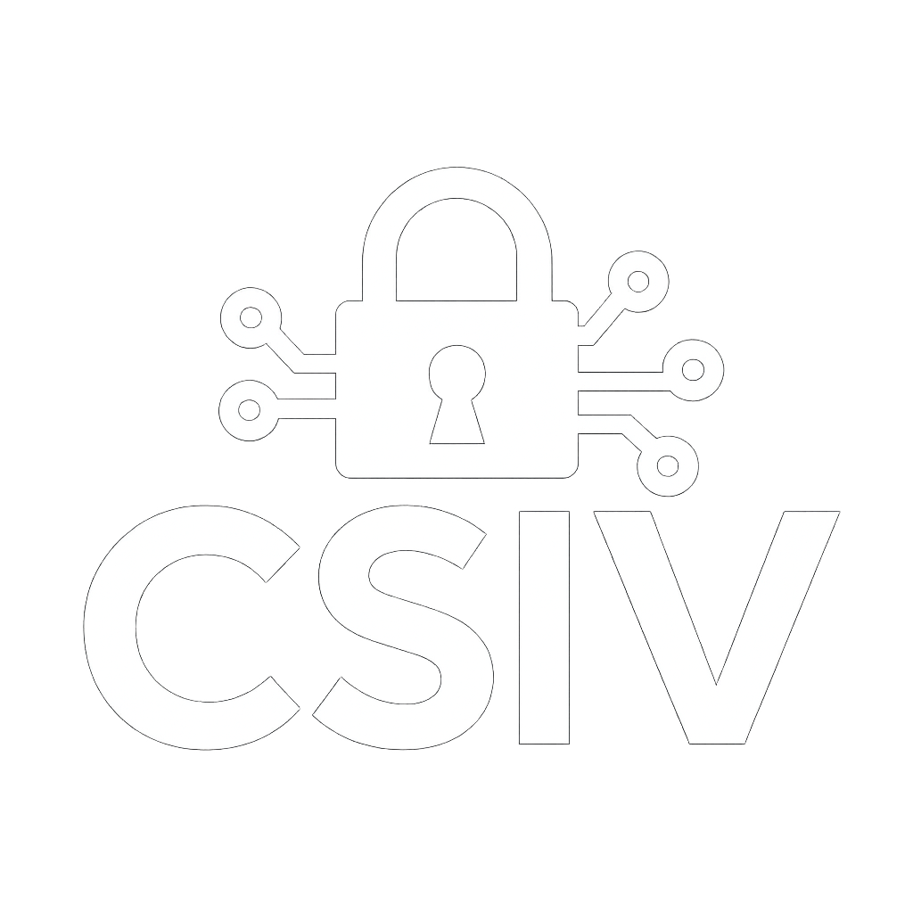

  <h1>CyberSecurity Interview Vault (CSIV)</h1>
  

  

    A Minimalist Cyber Security Interview Trainer
     
    <a href="https://csiv.lucaprc.fr"><strong>Accéder au site web</strong></a>
     
  

CSIV est une petite web app minimaliste pour s’entraîner rapidement aux questions d’entretien en cybersécurité.
Tu ouvres le site, une question apparaît, tu réfléchis, puis tu affiches la réponse.
Tu peux filtrer par catégorie / niveau / fréquence.

## Accessibilité
1. Site accessible ici via ce lien [csiv.lucaprc.fr](https://csiv.lucaprc.fr).
2. Langue française et anglaise disponible.
3. Fonctionnalité de signalement des questions inappropriées ou incorrectes.

## Proposer des questions

Il est possible de proposer des questions via un formulaire directement intégré au site.
Les propositions complètes sont appréciées, mais une simple question en français ou en anglais est la bienvenue.

## Stack
- Next.js 16
- TypeScript
- Tailwind CSS
- Framer Motion
